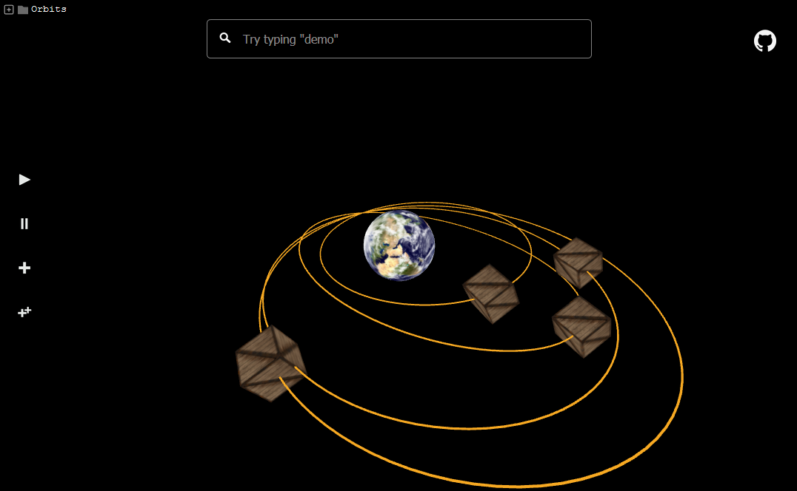
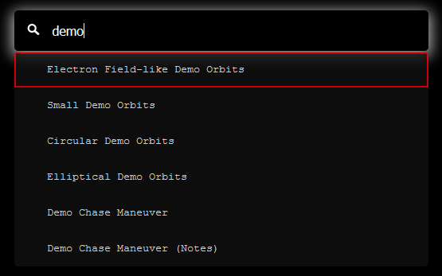
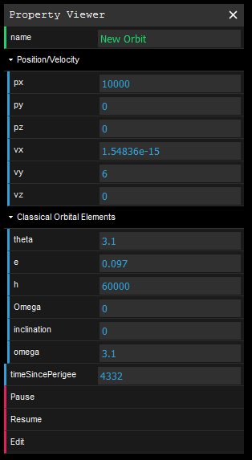
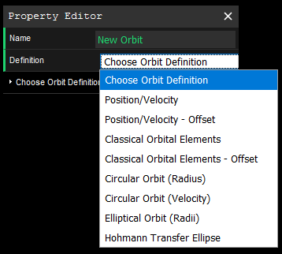

# Orbits Visualization

3D Orbit Visualization and Computation

[View the application here](https://boom-roasted.github.io/orbits/)

## How to Use

### Pre-defined orbits

Create a set of demo orbits by clicking the "++" toolbar button, or by searching for "demo" in the search bar.

### Toolbar

* Play (set satellites in motion)

* Pause (stop satellites in motion)

* Add new orbit

* Add a pre-defined set of orbits

  

  ### View Orbital Properties

  To view orbital properties, click the orbit's name in the tree. The 3D position, velocity, and classical orbital elements are displayed (and update in simulation time when the satellite is moving)

  

### Create New Orbits

There are multiple ways to define a new orbit.  Start by clicking the "+" on the toolbar. You may specify a 3D position and velocity, or specify a position *offset* from another existing orbit. You can also specify classical orbital elements or use a number of other options.

## Credits

Github icon made by [Dave Gandy](https://www.flaticon.com/authors/dave-gandy)
